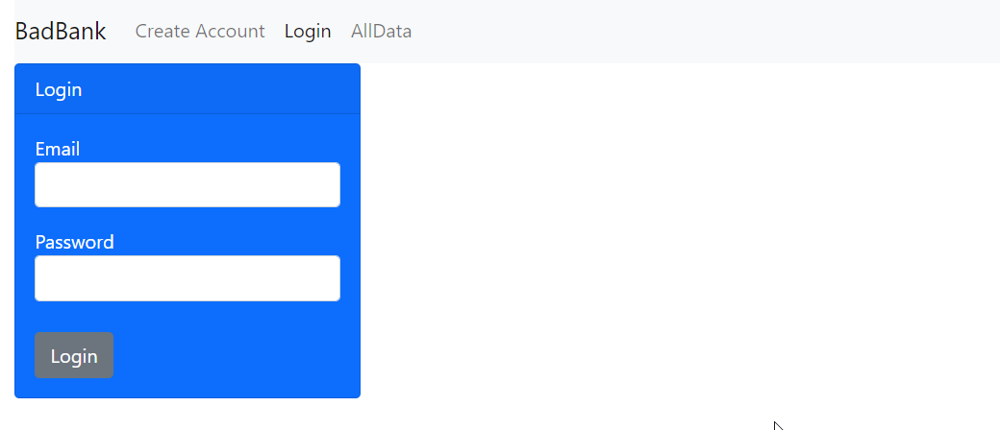

# Bad Bank

## On `master` branch

This project emulates how a withdraw and deposit works on a bank. It has a login that you need to use before you can use the `withdraw` and `deposit` features, the credentials that can be used are placed on the `All Data` tab. All this happens on the browser so no data is persisted

### To Run: 

1. run `npm install`
2. run `npm start`

## On `api-connection`



We have the same project in this branch, the difference is that it's now using firebase for authentication, and making calls to an api made in express ([BadBank backend](https://github.com/jfdlv/badbank-backend));

### To Run in development mode: 

- Update your firebaseConfig.js file with your info:
```js
// Import the functions you need from the SDKs you need
import { initializeApp } from "firebase/app";
import "firebase/auth";
// TODO: Add SDKs for Firebase products that you want to use
// https://firebase.google.com/docs/web/setup#available-libraries

// Your web app's Firebase configuration
const firebaseConfig = {
  apiKey: "your info goes here",
  authDomain: "your info goes here",
  projectId: "your info goes here",
  storageBucket: "your info goes here",
  messagingSenderId: "your info goes here",
  appId: "your info goes here"
};

// Initialize Firebase
const app = initializeApp(firebaseConfig);

export {app}
```
- start the [backend](https://github.com/jfdlv/badbank-backend) 
- make sure your routes are pointing correctly  to the server you just started
- run `npm install`
- run `npm start`

### Technology Used
- React
- Firebase
- Bootsrap
- React-bootstrap
- lodash
- formik

### Features

#### Current features:
- Login
- Create Account
- Withdraw
- Deposit

#### Future features:
- Transaction between users.

### License: MIT

This project was bootstrapped with [Create React App](https://github.com/facebook/create-react-app).

## Available Scripts

In the project directory, you can run:

### `npm start`

Runs the app in the development mode.\
Open [http://localhost:3000](http://localhost:3000) to view it in the browser.

The page will reload if you make edits.\
You will also see any lint errors in the console.

### `npm test`

Launches the test runner in the interactive watch mode.\
See the section about [running tests](https://facebook.github.io/create-react-app/docs/running-tests) for more information.

### `npm run build`

Builds the app for production to the `build` folder.\
It correctly bundles React in production mode and optimizes the build for the best performance.

The build is minified and the filenames include the hashes.\
Your app is ready to be deployed!

See the section about [deployment](https://facebook.github.io/create-react-app/docs/deployment) for more information.

### `npm run eject`

**Note: this is a one-way operation. Once you `eject`, you can’t go back!**

If you aren’t satisfied with the build tool and configuration choices, you can `eject` at any time. This command will remove the single build dependency from your project.

Instead, it will copy all the configuration files and the transitive dependencies (webpack, Babel, ESLint, etc) right into your project so you have full control over them. All of the commands except `eject` will still work, but they will point to the copied scripts so you can tweak them. At this point you’re on your own.

You don’t have to ever use `eject`. The curated feature set is suitable for small and middle deployments, and you shouldn’t feel obligated to use this feature. However we understand that this tool wouldn’t be useful if you couldn’t customize it when you are ready for it.

## Learn More

You can learn more in the [Create React App documentation](https://facebook.github.io/create-react-app/docs/getting-started).

To learn React, check out the [React documentation](https://reactjs.org/).

### Code Splitting

This section has moved here: [https://facebook.github.io/create-react-app/docs/code-splitting](https://facebook.github.io/create-react-app/docs/code-splitting)

### Analyzing the Bundle Size

This section has moved here: [https://facebook.github.io/create-react-app/docs/analyzing-the-bundle-size](https://facebook.github.io/create-react-app/docs/analyzing-the-bundle-size)

### Making a Progressive Web App

This section has moved here: [https://facebook.github.io/create-react-app/docs/making-a-progressive-web-app](https://facebook.github.io/create-react-app/docs/making-a-progressive-web-app)

### Advanced Configuration

This section has moved here: [https://facebook.github.io/create-react-app/docs/advanced-configuration](https://facebook.github.io/create-react-app/docs/advanced-configuration)

### Deployment

This section has moved here: [https://facebook.github.io/create-react-app/docs/deployment](https://facebook.github.io/create-react-app/docs/deployment)

### `npm run build` fails to minify

This section has moved here: [https://facebook.github.io/create-react-app/docs/troubleshooting#npm-run-build-fails-to-minify](https://facebook.github.io/create-react-app/docs/troubleshooting#npm-run-build-fails-to-minify)
